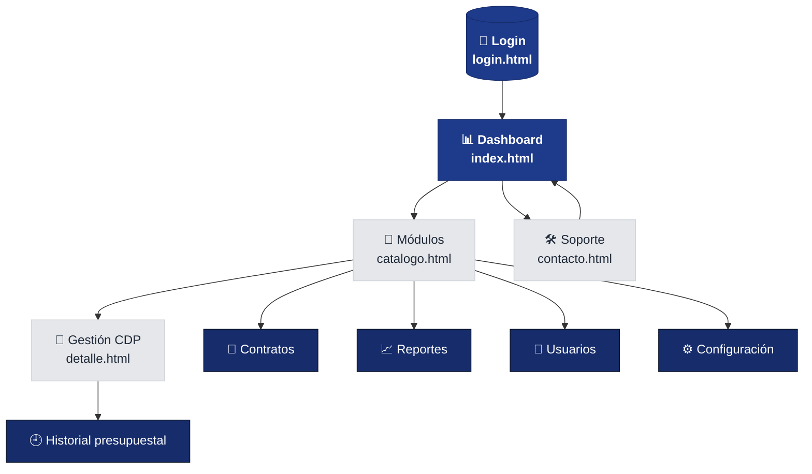
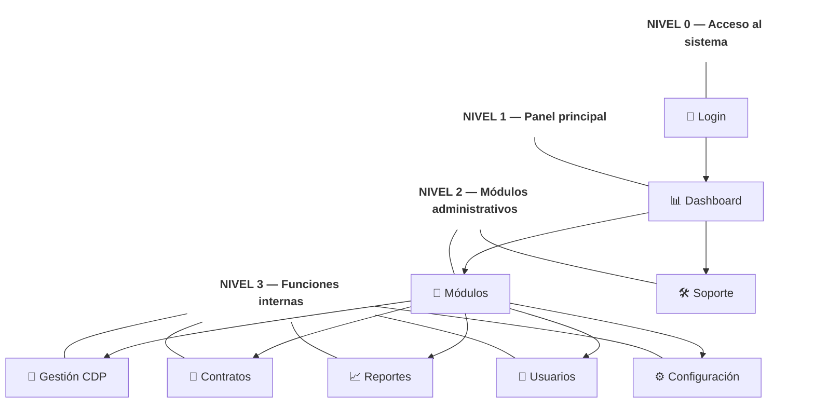
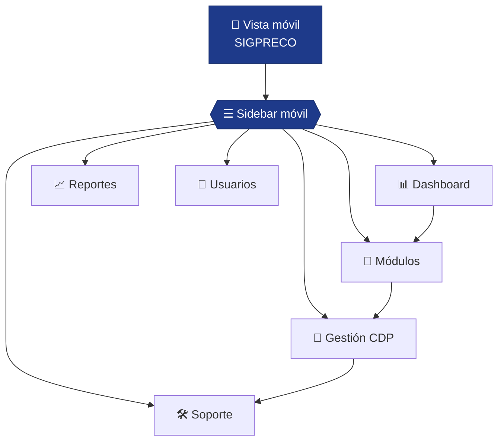

# Mapa de navegación — SIGPRECO

> Diagrama jerárquico de navegación del sistema SIGPRECO.
> Sistema orientado a la gestión presupuestal y administrativa institucional.
> Elaborado en **Mermaid** para las evidencias EV05 y EV07.

Conexión con evidencias:

- **GA5-EV05** — mapa de navegación web
- **GA5-EV07** — navegación responsive y móvil

---

# Mapa principal del sistema

---

# Niveles jerárquicos

---

# Mapa de navegación — versión móvil

En dispositivos móviles el sistema adapta el sidebar lateral a una navegación vertical optimizada para pantallas pequeñas, manteniendo accesibilidad y navegación responsive.

---

# Diferencias clave móvil vs escritorio

| Elemento        | Móvil                      | Escritorio                    |
| --------------- | -------------------------- | ----------------------------- |
| Navegación      | Sidebar vertical adaptable | Sidebar lateral fijo          |
| Dashboard       | Cards en 1 columna         | Cards en múltiples columnas   |
| Formularios     | Diseño apilado             | Distribución más amplia       |
| Layout          | Flujo vertical             | Layout dividido               |
| Acceso módulos  | Scroll vertical            | Navegación lateral permanente |
| Panel principal | Compacto                   | Expandido                     |

---

# Convenciones del mapa

- **Nodo redondeado** `(("..."))` → acceso principal del sistema
- **Nodo rectangular** `["..."]` → módulos y páginas internas
- **Nodo hexagonal** `{{"..."}}` → componente desplegable o navegación móvil
- **Flecha sólida** `-->` → navegación principal
- **Color azul oscuro** → páginas principales del sistema
- **Color gris** → módulos secundarios
- **Color azul intenso** → acciones y funcionalidades internas
