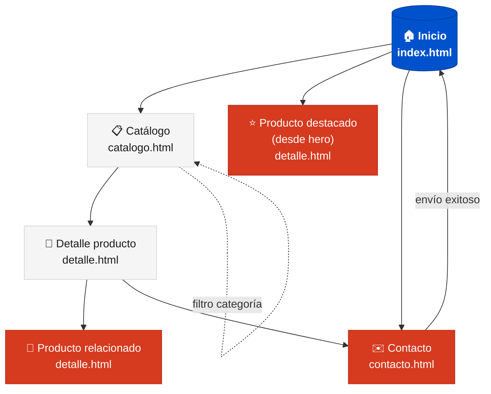
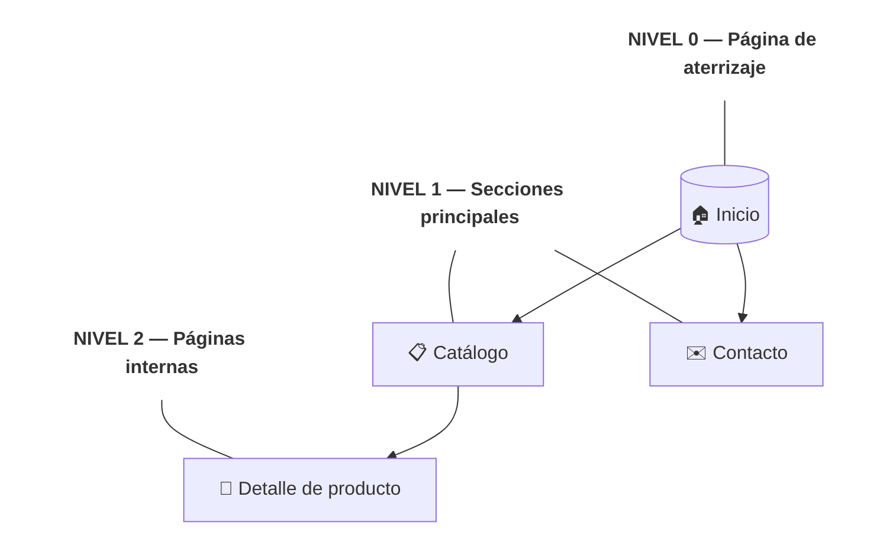
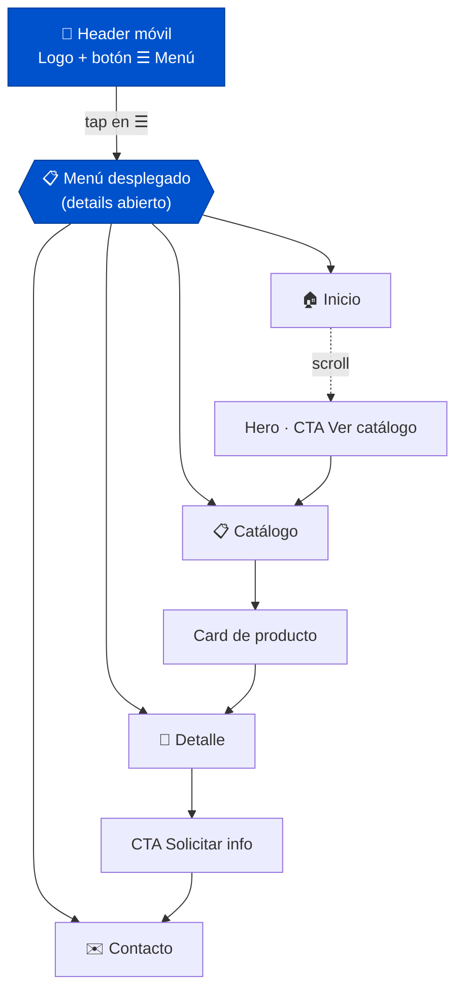

# Mapa de navegación — TechShop ADSO

> Diagrama jerárquico de cómo se conectan las páginas del sitio.
> Hecho en **Mermaid** — listo para entregar como EV05 (mapa web) y EV07 (mapa móvil).

Conexión con evidencias:
- **GA5-EV05** — mapa de navegación (web)
- **GA5-EV07** — interfaz gráfica + mapa de navegación móvil

---

## Mapa principal del sitio

---

## Niveles jerárquicos

---

## Mapa de navegación — versión móvil

En móvil la navegación principal **colapsa en un menú `
`** que se despliega al tocar "Menú". Las relaciones entre páginas son las mismas, solo cambia el acceso visual al menú.

### Diferencias clave móvil vs escritorio

| Elemento | Móvil | Escritorio |
|---|---|---|
| Nav | `
` desplegable | Horizontal siempre visible |
| Grid de productos | 1 columna | 3 columnas |
| Detalle | 1 columna (imagen arriba, info abajo) | 2 columnas (imagen ⟷ info) |
| Footer | Apilado vertical | Logo izquierda + enlaces derecha |
| CTA primario | Ancho completo | Ancho según contenido |

---

## Convenciones del mapa

- **Nodo redondeado** `(("..."))` → página de aterrizaje (home)
- **Nodo rectangular** `["..."]` → página interna
- **Nodo hexagonal** `{{"..."}}` → menú o componente desplegable
- **Flecha sólida** `-->` → enlace de navegación normal
- **Flecha punteada** `-.->` → navegación condicional o filtro
- **Color azul** → página principal (home)
- **Color gris** → páginas secundarias
- **Color naranja** → acciones / CTA
