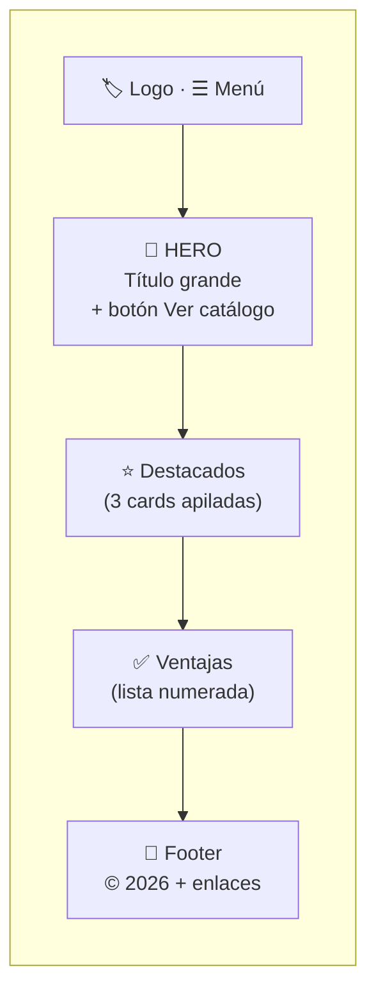
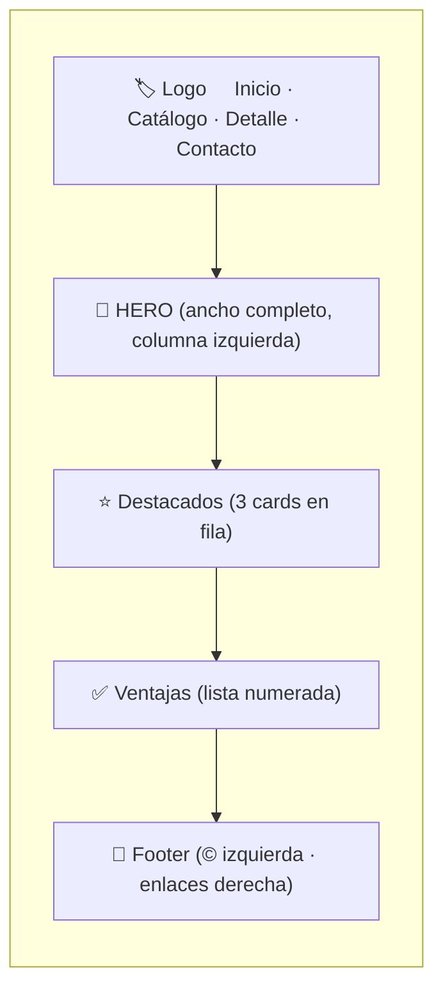
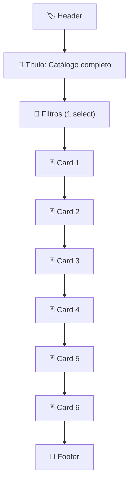
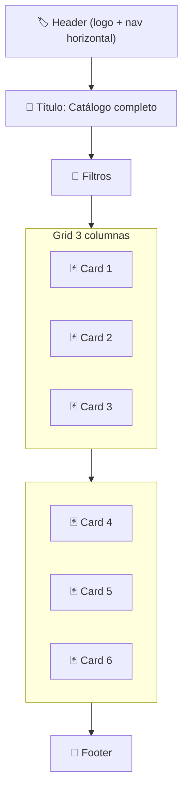
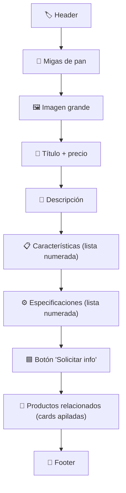
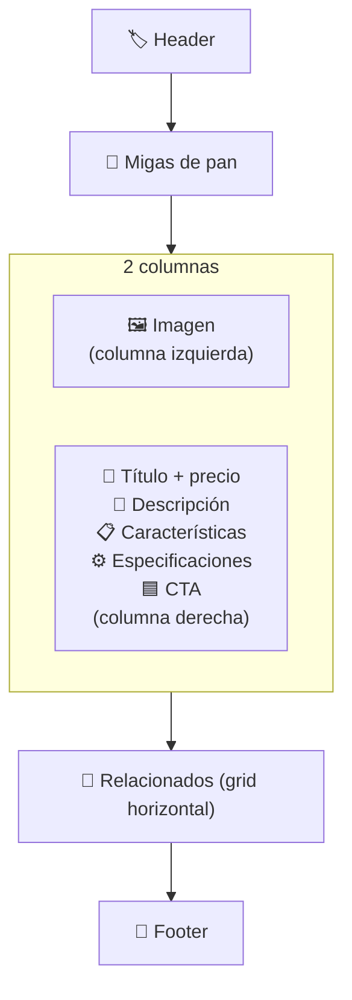
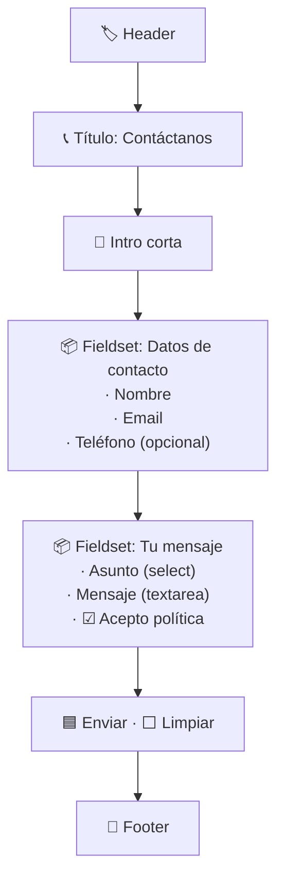

# Wireframes — TechShop ADSO

> Bocetos de baja fidelidad de las 4 pantallas del sitio, en versión móvil y escritorio.
> Hechos en **Mermaid** para que cualquiera pueda editarlos sin software extra.

Conexión con evidencias:
- **GA5-EV03** (interfaz gráfica + mapa de navegación — web)
- **GA5-EV07** (interfaz gráfica + mapa de navegación — móvil)

---

## 1. Inicio (`index.html`)

### Móvil (≤ 599 px)

### Escritorio (≥ 900 px)

---

## 2. Catálogo (`catalogo.html`)

### Móvil

### Escritorio

---

## 3. Detalle de producto (`detalle.html`)

### Móvil

### Escritorio

---

## 4. Contacto (`contacto.html`)

### Móvil

### Escritorio

Mismo flujo pero el formulario tiene `max-width: 500px` y queda centrado en la columna principal. No cambia la estructura — solo el ancho.

---

## Convenciones del wireframe

| Símbolo | Significado |
|---|---|
| 🏷️ | Cabecera con logo + nav |
| 🎯 | Sección hero (llamado de atención) |
| ⭐ | Destacados |
| 🃏 | Card individual de producto |
| 🔧 | Filtros / aside |
| 🍞 | Breadcrumb / migas de pan |
| 📦 | Fieldset de formulario |
| 🟦 | Botón primario |
| ⬜ | Botón secundario |
| 📄 | Footer |

## Notas para EV04 (maquetación HTML)

Cada bloque del wireframe corresponde a un elemento semántico:
- 🏷️ → `<header>` con `<nav>`
- 🎯 / ⭐ / ✅ → `<section>` con `<h2>` propio
- 🃏 → `<article>` dentro de un `<li>` del `<ul class="product-grid">`
- 🔧 → `<aside>`
- 📦 → `<fieldset>` con `<legend>`
- 📄 → `<footer>`
